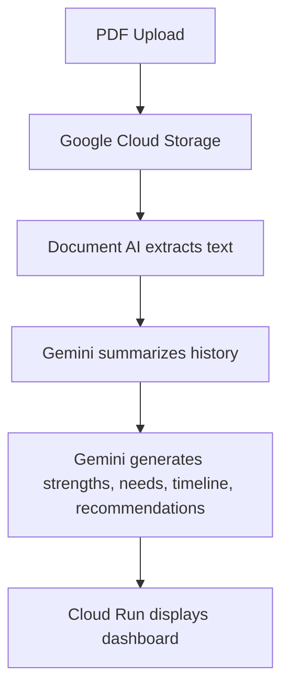

# The Lifelong Profile — IEP Companion

Project working document — FSI Hack4Autism 2026
*Use Case #2 — AI-Assisted Program Development & Summarization*

---

## 1. What we are building (in one line)

An AI companion that ingests a child's history of autism-related documents and helps families **understand, prepare for, and get more from the IEP process** — built strengths-first, with every claim traceable to a source, and designed to help people make better decisions rather than to replace them.

IEP = Individualized Education Program. It is a legally binding plan a school must produce each year for a child with special needs. It is negotiated in a single annual meeting, it is dense and jargon-heavy, and parents often do not see the draft before they walk in.

---

## 2. The problem (from the parents on our team)

Two parents on the team live this process every year. The problem they described:

- **One short meeting decides the year.** All the data and opinions from parents, teachers, aides and behavior analysts get compressed into a single ~2-hour meeting. There is little room for oversight.
- **Parents go in blind.** The draft IEP is usually not shared in advance — families first see it across the table at the meeting itself.
- **It is legally binding and often contentious.** Once agreed, the school must follow it; revising or contesting it has legal consequences. Families sometimes bring advocates or lawyers.
- **It is hard to understand.** IEPs read like legal documents. Without years of experience, the terminology does not make sense to most parents.
- **A huge amount of useful data is lost.** Day-to-day session notes from RBTs/technicians, psychoeducational evaluations, school evaluations, even email threads — most of it never makes it into the plan, even though it could really help.

> *"When you bring a new provider on, you can't have them read 300 pages. They need to know: who is this child, and how do we help?"*

---

So the profile we build should capture, for one individual:

## 3. Recommended Workflow



```text
PDF Upload
	↓
Google Cloud Storage
	↓
Document AI extracts text
	↓
Gemini summarizes history
	↓
Gemini generates strengths, needs, timeline, recommendations
	↓
Cloud Run displays dashboard
```

### Architecture Notes

- **PDF Upload:** Families and providers can submit existing evaluations, IEPs, session notes, and reports without changing their current workflow.
- **Google Cloud Storage:** Acts as durable, scalable document storage and a clean handoff point for downstream processing.
- **Document AI extracts text:** Converts scanned and mixed-format PDFs into structured text so key educational and clinical details are machine-readable.
- **Gemini summarizes history:** Produces a concise, chronological view of the child's background to reduce prep time for IEP conversations.
- **Gemini generates strengths, needs, timeline, recommendations:** Turns extracted evidence into actionable, strengths-first planning inputs aligned with IEP preparation.
- **Cloud Run displays dashboard:** Hosts a lightweight, secure web dashboard that presents outputs to families and team members in one place.

## 4. Non-Functional Requirements

- **Privacy & compliance:** All child and family data must be encrypted in transit and at rest. Access must follow least-privilege principles and support FERPA-aligned handling practices.
- **Consent & access control:** Only authorized users (for example, parent/guardian and approved providers) can view a profile. The system must support role-based access and clear permission boundaries.
- **Traceability:** Every generated summary, strength, need, and recommendation must include source references to original documents/snippets.
- **Explainability:** AI outputs should be presented in plain language with confidence signals or uncertainty notes where applicable.
- **Latency targets:**
	- Document ingestion to extracted text: target under 2 minutes for typical PDFs.
	- Profile summary generation after extraction: target under 30 seconds.
	- Dashboard page load: target under 3 seconds on standard broadband.
- **Reliability:** Core workflow availability target of 99.9% monthly uptime for upload, processing, and dashboard access.
- **Scalability:** The platform should support concurrent uploads and processing jobs without major degradation in user-facing response times.
- **Observability & audit:** Maintain audit logs for uploads, processing events, model output generation, and user access actions.
- **Data retention & deletion:** Define configurable retention windows and support secure deletion on request.
- **Human-in-the-loop safety:** The system provides decision support only; final educational and clinical decisions remain with families and professionals.
